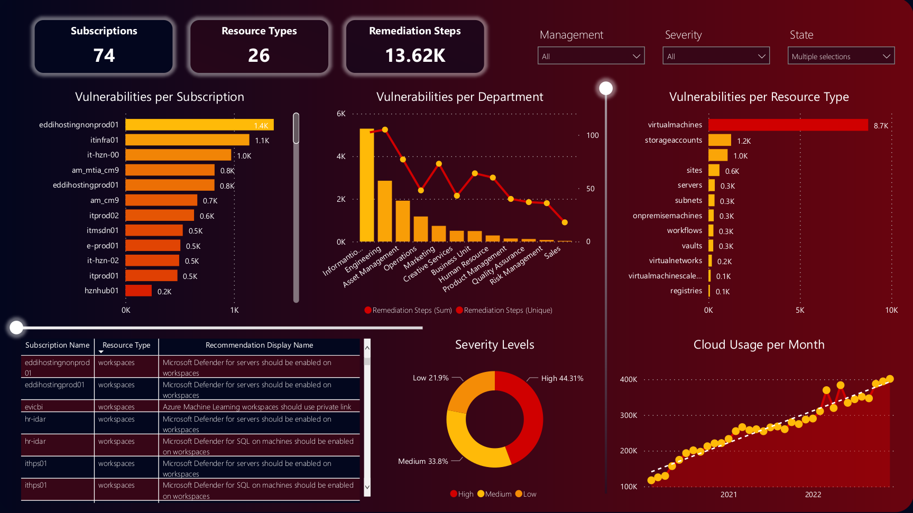

# Azure Security Score

## 1. Introduction

### 1.1 Overview

This project involves performing a comprehensive analysis of vulnerabilities identified in Azure Security Center using Pandas and Power BI. The goal is to prioritize the resolution of these vulnerabilities to ensure business continuity.

This document provides a high-level overview of the workflow involved in the following steps:

- Extracting a table from Azure Security Center.
- Extracting a table from Azure REST API.
- Cleansing and merging the two tables to prepare the data for visualization in Power BI.

## 2 Logical Architecture

### 2.1 Logical System Component Overview

In the logical architecture, the following steps take place:

- Two tables are pulled from Azure Security Center and Azure REST API and transferred to AWS Sagemaker Studio lab for exploratory data analysis (EDA).

- Data wrangling is performed using Jupyter Lab to prepare the data for consumption by Power BI.

- The notebook containing the data analysis and preparation steps is pushed to a GitHub repository.

- A Power BI report is created using the ingested and prepared data.

- The end users can then consume the Power BI report to gain insights into the Azure Security Center vulnerabilities.

## 3 Power BI Report Link

Ref: [Interactive Power BI Dashboard Link](https://lyoh001.com/mlcloudaudit)

This link provides access to an interactive Power BI dashboard that presents the analyzed Azure Security Center vulnerabilities in a visually appealing and intuitive manner.

## 4 ETL Notebook

Ref: [ETL Notebook Link](notebook/notebook.ipynb)

The ETL (Extract, Transform, Load) notebook contains the code and steps for extracting and transforming the data from Azure Security Center and Azure REST API. It also includes the necessary data cleansing and merging operations to prepare the data for visualization in Power BI.

## 5 MS Docs Link

Ref: [MS Docs: Azure REST API](https://learn.microsoft.com/en-us/rest/api/managementgroups/)

This link provides documentation for the Azure REST API, which can be helpful for understanding and working with the API to extract the necessary data from Azure Security Center.

