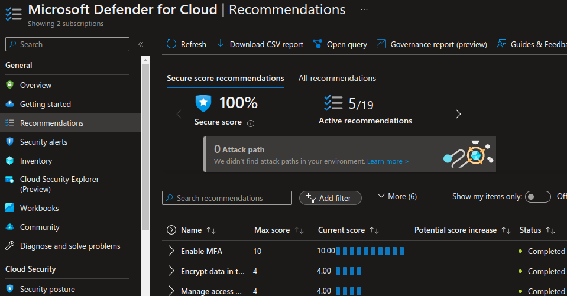
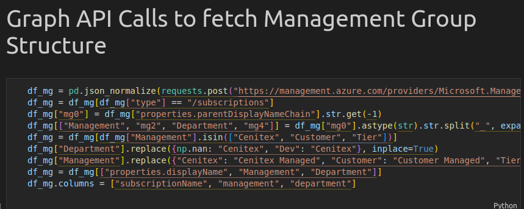
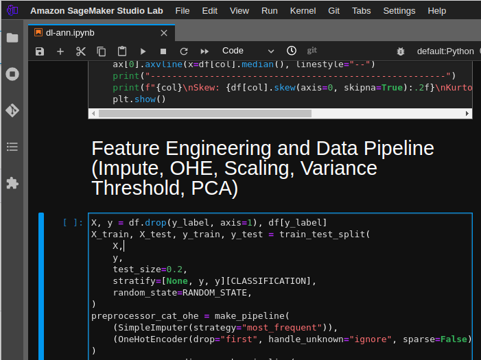
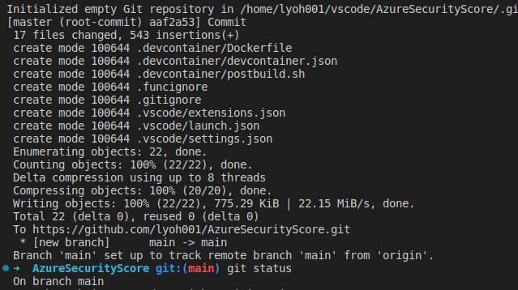
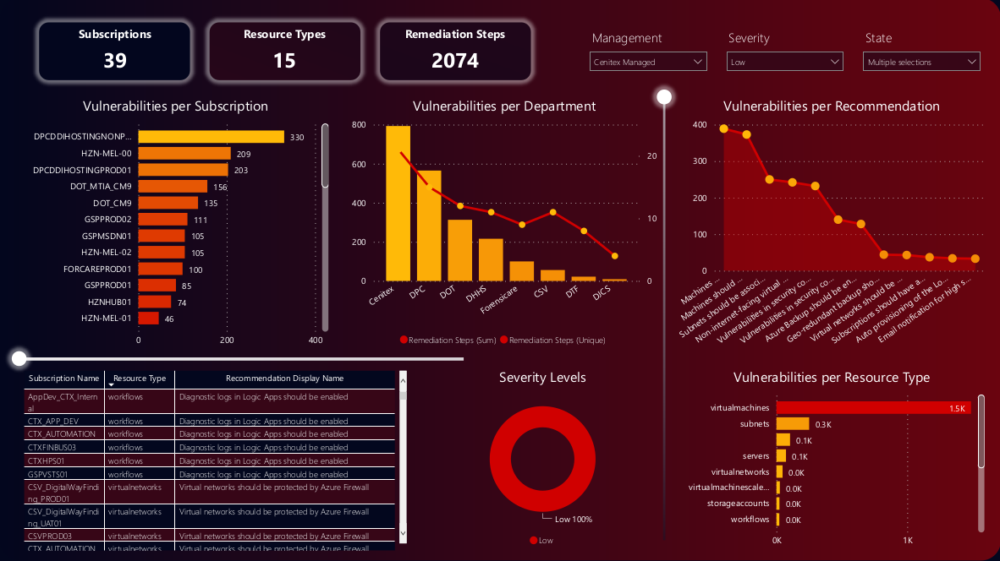

#  Azure Security Score
## 1. Introduction
### 1.1	Overview
Performed a full analysis on vulnerabilities identified from Azure Security Center using Pandas and Power BI in order to determine what to prioritize when rectifying highlighed items in cloud for business continuity.

This document is intended to provide a high level overview of workflow on the following.
- Extracting a table from Azure Security Center.
- Extracting a table from Azure REST API.
- Cleansing and Merging 2 tables to feed to Power BI to build a visual report.

## 2 Logical Architecture
### 2.1	Logical System Component Overview

- 2 tables get pulled from Azure Security Center and Azure REST API to AWS Sagemaker Studio lab for EDA.

- Data wraggling to be performed via Jupyter lab to feed data to Power BI.

- Notebook gets pushed to github repo.

- Power BI report gets built with the ingested data.

- The end users can consume the BI report.

## 3 Power BI report Link
Ref: [Power BI Report Link](images/powerbi.png)

## 4 ETL Notebook
Ref: [ETL Notebook Link](notebook/notebook.ipynb)

## 5 MS Docs Link
Ref: [MS Docs: Azure REST API](https://learn.microsoft.com/en-us/rest/api/managementgroups/)

